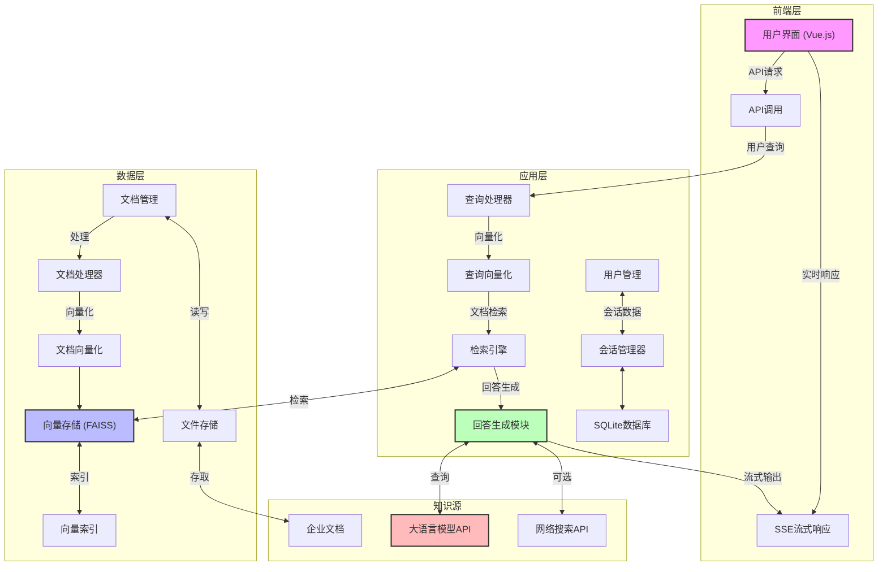

# KnowledgeNexus: 企业智能知识库系统

<div align="center">
  
  
  
  
  
  
</div>

## 项目概述

KnowledgeNexus 是一个基于检索增强生成(RAG)技术的企业级智能知识库系统。该系统能够对企业文档进行智能检索并结合大语言模型提供准确的问答服务，支持多种文档格式，实现了知识的智能获取与应用。

### 核心功能

- **智能文档管理**: 支持上传、管理和删除 TXT、PDF、DOCX 等多种格式文档
- **语义检索**: 基于向量相似度的高效文档检索系统
- **对话式交互**: 流畅的对话界面，支持连续多轮对话
- **会话管理**: 完整的会话历史记录和管理功能
- **流式响应**: 实时打字机效果的回答生成
- **联网能力**: 可选的网络搜索扩展知识边界

## 系统架构



## 技术栈

### 后端
- **FastAPI**: 高性能异步Web框架
- **Sentence-Transformers**: 文本向量化模型
- **FAISS**: 高效向量检索引擎
- **SQLite**: 轻量级关系数据库
- **OpenAI API 兼容接口**: 支持接入多种大语言模型

### 前端
- **Vue.js**: 响应式前端框架
- **Bootstrap**: UI组件库
- **Marked.js**: Markdown渲染
- **Highlight.js**: 代码语法高亮
- **SSE**: 服务器发送事件，实现流式响应

## 环境配置

### 系统要求
- Python 3.8+
- 足够的磁盘空间用于存储文档和索引
- 网络连接（用于模型API调用和可选的网络搜索功能）

### 安装步骤

```bash
# 创建虚拟环境
python -m venv .venv

# 激活虚拟环境
source .venv/bin/activate  # Linux/Mac
# 或
.venv\Scripts\activate  # Windows

# 更新pip
pip install --upgrade pip

# 安装依赖
pip install -r requirements.txt
```

## 运行应用

```bash
python app.py
```

访问 http://localhost:8000/static/chat.html 开始使用系统。

## 使用指南

### 文档管理
1. 访问 http://localhost:8000/static/documents.html
2. 点击"上传文档"按钮添加企业知识文档
3. 上传完成后，文档将自动向量化并建立索引

### 智能问答
1. 访问 http://localhost:8000/static/chat.html
2. 在输入框中输入您的问题
3. 系统将自动检索相关文档并生成回答
4. 可选择是否启用联网搜索功能

### 会话管理
- 历史会话显示在左侧边栏
- 可以点击任意历史会话继续对话
- 支持删除不需要的历史会话

## 项目结构

- **app.py**: 主应用入口，包含核心业务逻辑
- **static/**: 前端页面和资源文件
- **docs/**: 文档存储和索引目录
- **step1/**: 基础RAG示例
- **step2/**: 改进版RAG，支持SQLite
- **stream_test/**: 流式输出测试模块

## 开发工具

### SQLite工具
推荐使用 Navicat Premium Lite（免费版）  
下载地址：https://www.navicat.com.cn/download/navicat-premium-lite

## 性能优化建议

- 对于大型文档库，建议使用更强大的向量数据库如Milvus或Pinecone
- 针对高并发场景，考虑部署多实例并引入负载均衡
- 频繁访问的文档内容可以引入缓存机制提高响应速度

## 许可证

MIT License

## 联系方式

如有问题或建议，请提交 Issue 或联系项目维护者。
